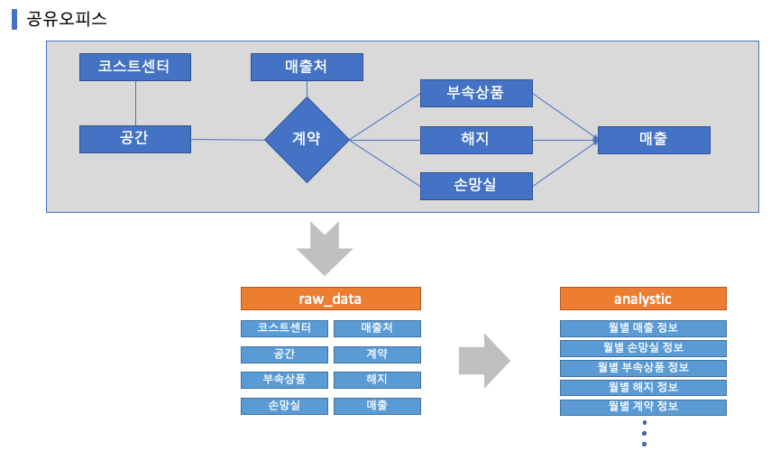

## 2주차 과제

### MAU(Monthly Active User) 구하기
* [mau_count.sql](./mau_count.sql)
```SQL
select
    to_char(ST.TS, 'YYYY-MM') as YEAR_MONTH
  , count(distinct(USC.USERID)) as ACTIVE_USER
from RAW_DATA.USER_SESSION_CHANNEL         USC
     inner join RAW_DATA.SESSION_TIMESTAMP ST on USC.SESSIONID = ST.SESSIONID
group by 1
order by 1
;
```

### 데이터웨어하우스에 넣을 데이터 모델링
* 현업 혹은 가상/실제 서비스들의 엔티티를 생각하여 데이터웨어하우스에 넣을 엔티티를 모델링 해보기
* 현재 개발중인 공유오피스 ERP 프로젝트의 내용으로 진행
* 실제로는 배치 애플리케이션에서 스케줄링되어 운영DB(Oracle)의 서머리 테이블에 저장되고 있음
* 운영DB에서 분석용 테이블을 분리하기 위헤 데이터웨어하우스 구축을 해본다는 가정하에 진행
